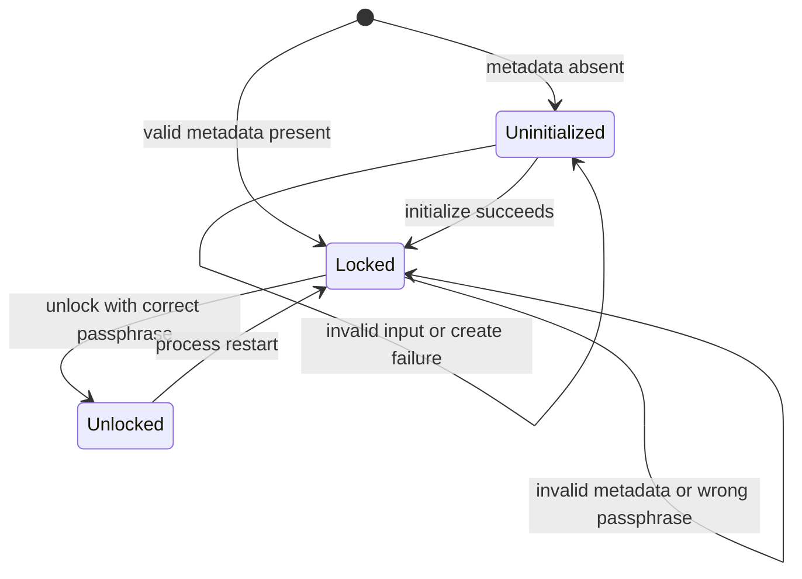

# Implementation Plan: Feature 0.1 — Vault Initialization and Unlock

## Scope and baseline

Implement only Feature 0.1 from `spec.md` and Section 5.1 of `SPEC.md`: first-run initialization, runtime unlock, encrypted DEK metadata, and the locked-vault gate required by future KV and Transit operations. The current assessment is a pure skeleton: `main.py` only prints placeholder text; `src/core/vault.py`, `src/storage/repository.py`, `src/crypto_utils.py`, `src/kv/service.py`, and `src/transit/service.py` contain documentation only; `tests/test_skeleton.py` only verifies imports. `argon2-cffi`, `cryptography`, and `pytest` are already declared dependencies.

This feature does not implement user registration, sessions, KV persistence, or Transit cryptography. It establishes the vault contract those features must consume.

## Security decisions

### Argon2id

Use `argon2.low_level.hash_secret_raw` with `Type.ID` to derive a 32-byte AES-256 wrapping key.

| Parameter | Initialization value | Metadata validation bound |
|---|---:|---:|
| `memory_cost_kib` | 65536 | 16384 through 262144 |
| `time_cost` | 3 | 1 through 10 |
| `parallelism` | 1 | 1 through 4 |
| `hash_len` | 32 | exactly 32 |
| salt length | 16 bytes | 16 through 64 bytes |

The unlock parser must reject values outside these bounds before running Argon2id, preventing malformed metadata from causing unbounded resource use. Generate salt and DEK with `secrets.token_bytes`; both are 32 bytes for the DEK and 16 bytes for the salt.

Master-passphrase validation is performed before any DEK generation or persistence: minimum 15 characters and at least three of lowercase, uppercase, decimal digit, and symbol/whitespace categories. The passphrase is accepted as a local string only, never included in exception text, logs, metadata, return values, or test assertions.

### AES-256-GCM envelope

Generate a fresh 12-byte nonce and encrypt the 32-byte DEK using `cryptography.hazmat.primitives.ciphers.aead.AESGCM`. Use fixed UTF-8 AAD `mini-vault:metadata:v1`; it is a protocol constant and not serialized. `AESGCM.encrypt` produces ciphertext concatenated with its 16-byte authentication tag; persist that combined byte string in one base64 field. On unlock, any base64, metadata, KDF, GCM, or tag failure is indistinguishable externally from a wrong passphrase.

### Metadata JSON schema

The sole metadata location is `LAB1/data/vault_metadata.json`. It is schema version 1 and contains no plaintext secret material:

```json
{
  "schema_version": 1,
  "kdf": {
    "algorithm": "argon2id",
    "salt_b64": "base64 of 16 random bytes",
    "memory_cost_kib": 65536,
    "time_cost": 3,
    "parallelism": 1,
    "hash_len": 32
  },
  "aead": {
    "algorithm": "aes-256-gcm",
    "nonce_b64": "base64 of 12 random bytes",
    "ciphertext_and_tag_b64": "base64 of AES-GCM ciphertext concatenated with tag"
  }
}
```

Required validation: JSON root and nested values have the stated object/string/integer types; only the exact schema-version, KDF, and AEAD algorithm identifiers are accepted; required fields are present; unknown fields are rejected; base64 uses strict validation; decoded salt, nonce, and ciphertext-plus-tag lengths are valid; ciphertext-plus-tag is at least 17 bytes. Runtime lock state is intentionally not persisted, because persisted state must never cause a restart to unlock the vault.

## Domain and persistence contracts

### Domain errors

Create a base domain exception that exposes only a stable public `code`. Implement named domain exceptions for `INVALID_INPUT`, `ALREADY_INITIALIZED`, `UNLOCK_FAILED`, and `VAULT_LOCKED`; retain the existing constants in `src/errors.py` and add only the missing public constant. Callers and the CLI may display or branch only on the public code. Do not wrap or expose `InvalidTag`, decoding errors, JSON parser errors, filesystem paths, stack traces, or Argon2 diagnostics. Internally, map all unlock-time metadata and cryptographic failures to `UNLOCK_FAILED`.

### Vault state machine



A newly constructed `Vault` always starts without an in-memory DEK. If metadata exists it is `locked`; if absent it is `uninitialized`. A successful `initialize` writes metadata but deliberately leaves that same Vault instance locked and does not retain the generated DEK. A successful `unlock` decrypts into a local buffer first, verifies the result is exactly 32 bytes, then assigns the in-memory DEK and transitions to unlocked. Every unsuccessful unlock clears any temporary/local sensitive values and leaves the existing instance locked. The public DEK accessor must raise `VAULT_LOCKED` unless unlocked and must not be printed or returned by CLI paths.

### Repository create-only behavior

Give `src/storage/repository.py` a focused vault-metadata repository. It reads only the fixed metadata path and performs initialization writes with atomic create-only semantics:

1. Serialize and validate the complete metadata document before touching the destination.
2. Ensure `LAB1/data` exists with restrictive permissions where supported.
3. Create a same-directory temporary file with mode `0o600`, write the complete UTF-8 JSON, flush, and `fsync` it.
4. Atomically create the final path by hard-linking the temporary file to `vault_metadata.json`; an existing destination must fail rather than be replaced.
5. `fsync` the containing directory and remove the temporary name.
6. Translate an existing target, including concurrent initialization races, to `ALREADY_INITIALIZED`; clean only the temporary file owned by the operation.

Never use replace, truncate, or ordinary overwrite for vault metadata. Reads must make no changes. Repository failures must be translated to public domain errors at the Vault/CLI boundary without exposing operational details.

## Module and CLI implementation plan

1. Extend `src/errors.py` with domain exception classes and the `ALREADY_INITIALIZED` public code while preserving existing shared code constants.
2. Implement narrowly scoped helpers in `src/crypto_utils.py` for passphrase validation, strict base64 encoding/decoding, Argon2id derivation with bounds validation, AES-GCM wrapping/unwrapping, and zero-secret metadata construction/validation. Keep cryptographic primitives out of CLI and repository code.
3. Implement the metadata repository in `src/storage/repository.py`, parameterized only for tests where a temporary metadata path is required; production default remains `LAB1/data/vault_metadata.json`.
4. Implement `Vault` in `src/core/vault.py` with `is_initialized`, `is_locked`, `initialize`, `unlock`, and guarded in-memory DEK retrieval. Constructor state is derived from metadata existence but never loads a DEK.
5. Define lightweight dependency injection into KV and Transit services: both receive or reference the shared `Vault`, and every externally callable protected operation begins with the vault locked check. The required ordering is vault gate first, then future session validation, ownership authorization, parsing/storage, and cryptography. Guard KV `write`, `read`, `delete`; guard Transit `create_key`, `list_keys`, `revoke_key`, `encrypt`, `decrypt`, `create_signing_key`, `sign`, and `verify`.
6. Replace the CLI placeholder in `main.py` with argument parsing for `init`, `unlock`, and `status`. `init` and `unlock` read the passphrase through `getpass.getpass`, never command-line arguments, standard input echo, logs, or output. `status` reports only `uninitialized`, `locked`, or `unlocked`. Successful initialization reports that metadata was created and the vault remains locked; successful unlock reports unlocked. Expected domain failures print only their public code and exit nonzero; no traceback is shown in normal operation.

## Precise tests

Add focused pytest coverage separate from the import smoke test, using `tmp_path` for all metadata and monkeypatching/injection for the repository path.

1. **Initialization contract**: initialize a clean vault using a valid passphrase; assert the metadata file exists, validates against schema version 1, uses the fixed Argon2id values, has a 16-byte salt, 12-byte nonce, and combined ciphertext/tag field; assert the instance remains locked and no DEK accessor is allowed.
2. **No plaintext persistence**: inspect raw metadata bytes and decoded JSON; assert neither passphrase nor known generated/returned DEK data is stored, there is no plaintext-DEK field, and only schema/KDF/AEAD metadata plus base64 envelope fields exist.
3. **Weak passphrase rejects before write**: parameterize failing length/category examples; expect `INVALID_INPUT` and assert no metadata target or temporary residue exists.
4. **Create-only behavior**: initialize once, capture exact bytes, attempt second initialization and expect `ALREADY_INITIALIZED`; assert final bytes are unchanged. Simulate destination collision/race at publish time and assert the same result without replacement.
5. **Fresh entropy**: initialize two isolated paths with the same valid passphrase; assert salt, nonce, and ciphertext-plus-tag fields differ.
6. **Restart state**: initialize then construct a fresh Vault for the same repository; assert it starts locked and has no retrievable DEK regardless of prior process instance state.
7. **Correct unlock**: restart, unlock with correct passphrase, assert unlocked state and that the guarded service-facing DEK is 32 bytes; re-read metadata and assert bytes are unchanged.
8. **Generic unlock failures**: parameterize wrong passphrase, malformed JSON, unknown schema, unsupported KDF parameter, invalid strict base64, wrong nonce length, truncated ciphertext/tag, and a one-byte ciphertext/tag mutation. Each must raise only `UNLOCK_FAILED`, leave the vault locked, and reveal no cause-specific message.
9. **KDF validation bounds**: parameterize each lower/upper violation for memory, time, parallelism, hash length, and salt size; assert unlock rejects before or without successful derivation and returns `UNLOCK_FAILED` externally.
10. **Locked KV gate and ordering**: for `write`, `read`, and `delete`, use stubs that would fail if session, authorization, storage, or crypto are invoked. With a locked vault, assert `VAULT_LOCKED` and that no downstream stub was called.
11. **Locked Transit gate and ordering**: repeat with stubs for all listed Transit public operations; assert `VAULT_LOCKED` occurs before downstream parsing, authorization, key lookup, storage, or crypto.
12. **CLI behavior**: mock `getpass`, invoke `init`, `status`, and `unlock`; assert passphrases are prompted rather than passed as arguments, init reports locked afterward, unlock succeeds only for valid input, and wrong passphrase emits exactly `UNLOCK_FAILED` with nonzero exit and no traceback.

## Execution sequence

1. Add domain error model and metadata constants.
2. Implement and unit-test crypto helpers and schema validation.
3. Implement and test repository read plus atomic create-only publication.
4. Implement Vault state transitions and initialization/unlock integration tests.
5. Add KV and Transit constructor wiring plus first-operation locked gates and ordering tests.
6. Implement the minimal secure CLI and CLI tests.
7. Run the complete pytest suite, verify no generated production metadata is committed, and review error/output paths for secret or low-level leakage.

## Completion criteria

The feature is complete only when a clean initialization creates precisely the version-1 encrypted envelope at `LAB1/data/vault_metadata.json`, the originating process remains locked, fresh processes require successful unlock, all unsuccessful unlock variants reduce to `UNLOCK_FAILED`, repeat initialization cannot overwrite root material, and every protected KV/Transit entry point fails first with `VAULT_LOCKED` while locked.
